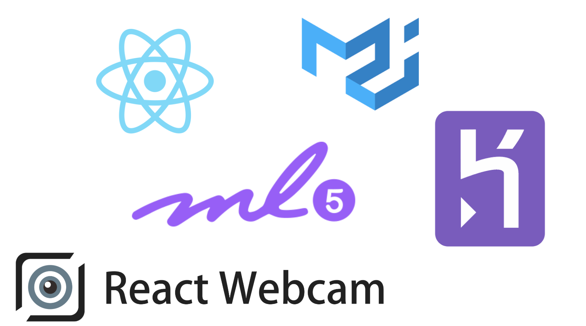

# Introduction

This was created during my time as a student at Code Chrysalis.
It was a solo project createing MVP app in two days.

## Overview

Magikarp Machine Learning is a machine learning game application with two functionalities.
With the first function as Magikarp, you can train Magikarp to remember things in front of your webcamera with any text you want.
The second function as Gyarados, it will classify predefined things using MobileNets.

## Installing Dependencies and Starting Up

Fork the app and git clone in your local computer.

First, install the dependencies for this project:

```shell
  $ yarn install
```

To run the app in development mode with hot-reloading:

```shell
  $ yarn start
```

## Technology Used

1. React (create-react-app) (https://github.com/facebook/create-react-app)
1. react-webcam: (https://www.npmjs.com/package/react-webcam)
1. ml5.js (https://ml5js.org/)
1. Material-UI (https://material-ui.com/)
1. Heroku (https://dashboard.heroku.com/)



## What challenges did you face?

The first plan of this app was machine learning that forgets everthing every one minute (Just like fish that forgets everthing).

As it seemed harder than expected to refresh models, it now offers two different functions as descrived in overview.

## What did you learn?

1. Basic React with Material UI.
1. Importance of investigating functionality first if it's feasible.
1. Using video takes too much memory and makes an app unstable.

## Future Ideas/Features

1. Less memory usage
1. Use Redux
1. Save the remembered model
1. Function to catch fish with body movement
